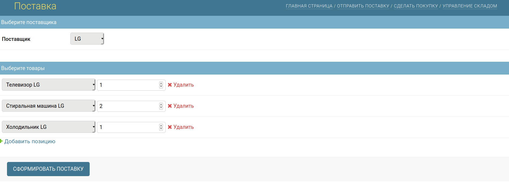
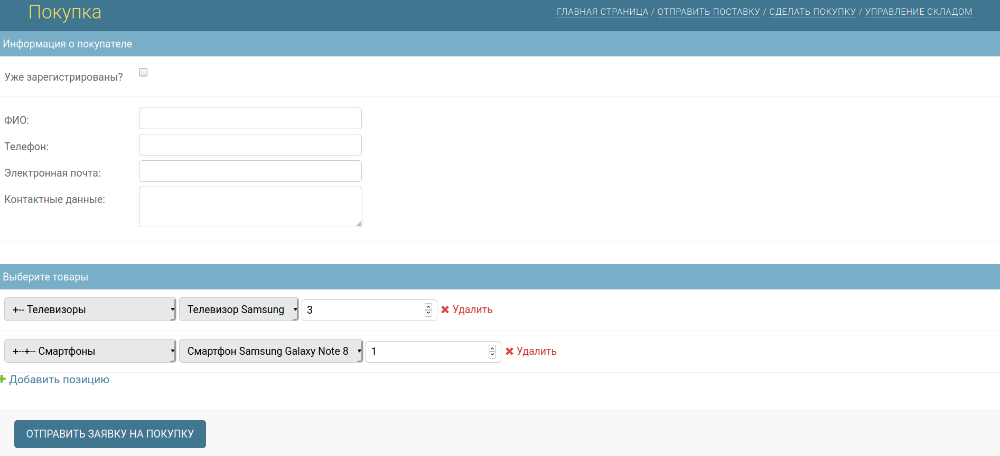
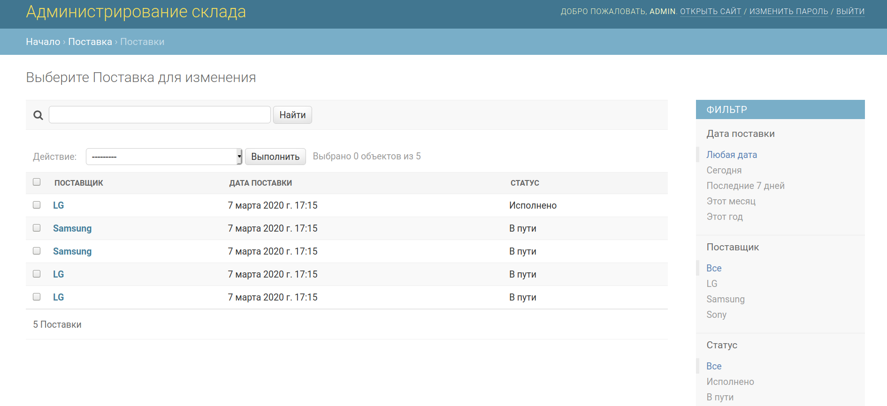
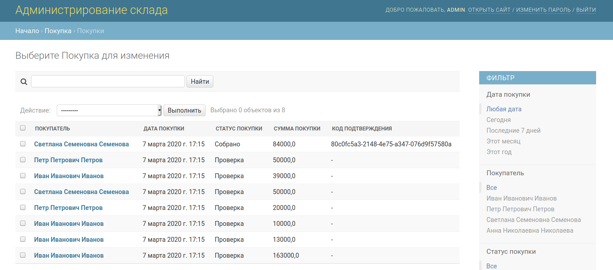
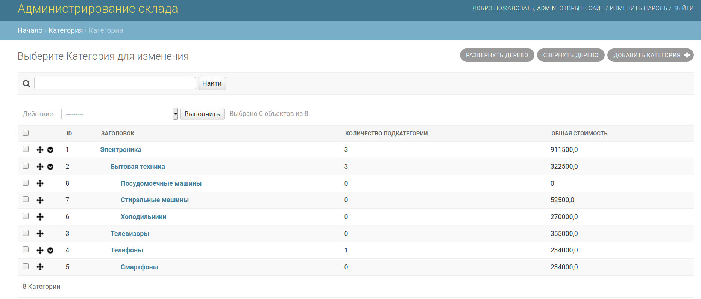

[](https://tldrlegal.com/license/mit-license) <br>

<hr>

Тестовое CRUD-приложение системы складского учёта на ```Django 3.0.8``` с базой данных ```SQLite3```.

<details>
  
  <summary>
   Как запустить
  </summary>

<br>

Один из вариантов - использовать дистрибутив Linux и установленный Docker<br> (протестировано на ```Ubuntu 20.04 LTS``` с установленным ```docker.io 19.03.8```).<br>
Будут загружены Docker образы Nginx и Alpine с python3.8,
затем создан образ контейнера приложения Django и два volume - директории для базы данных и статических файлов.<br> 
Доступ к сайту будет осуществляться через контейнер Nginx (порт 8888).<br>
Для установки нужно выполнить следующие команды в терминале:<br>

- клонировать репозиторий в нужную директорию, перейти в неё и добавить скрипту ```install.sh``` разрешение на выполнение
```sh
$ git clone https://github.com/96tm/warehouse-management-test.git; cd warehouse-management-test; chmod +x ./install.sh
```
- запустить скрипт установки, заменив<br>
```EMAIL_HOST``` на адрес почтового сервера для отправки сообщений,<br>
```EMAIL_ADDRESS``` на email на указанном почтовом сервере (будет использоваться как
email администратора),<br>
```EMAIL_PASSWORD``` на пароль для email, <br>
```CLIENT_EMAIL``` на email для тестовых пользователей (можно такой же, как ```EMAIL_ADDRESS```)
```sh
$ sudo ./install.sh "EMAIL_HOST" "EMAIL_ADDRESS" "EMAIL_PASSWORD" "CLIENT_EMAIL"
```
База будет заполнена тестовыми данными.
Сайт должен быть доступен по адресу 
<a href="http://localhost:8888">localhost:8888</a>. <br>
Для входа на <a href="http://localhost:8888/admin/login/">страницу администрирования</a> можно использовать тестового пользователя ```admin```
с паролем ```admin```.
Для остановки и удаления приложения нужно выполнить следующие команды в терминале:
```sh
$ chmod +x ./uninstall.sh; sudo ./uninstall.sh
```
Для удаления Docker образов Alpine и Nginx:
```sh
sudo docker image rm python:3.8-alpine; sudo docker image rm nginx:latest
```

</details>

<details>
  
  <summary>
    Что можно сделать + скриншоты
  </summary>

- создать поставку на странице <a href="http://localhost:8888/cargo_new">/cargo_new</a>

- создать покупку на странице <a href="http://localhost:8888/order">/order</a>;


- выбрать созданные поставку и покупку на страницах <a href="http://localhost:8888/admin/cargo/cargo">admin/cargo/cargo</a>
и <a href="http://localhost:8888/admin/shipment/shipment">/admin/shipment/shipment</a>;



- на странице поставки нажать "Подтвердить получение поставки";
- на странице покупки нажать "Подтвердить готовность к отправке"
(если количество товаров в покупке превышает количество товаров на складе,
кнопка будет скрыта).



</details>
