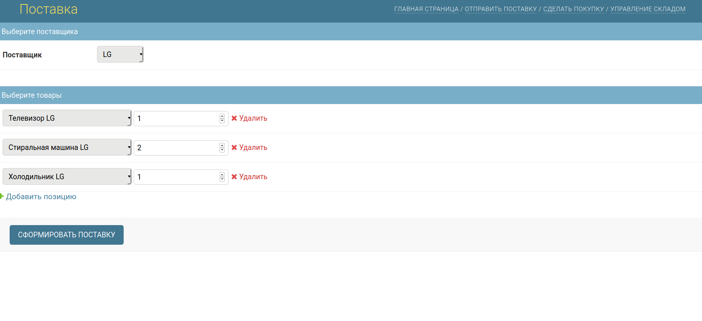
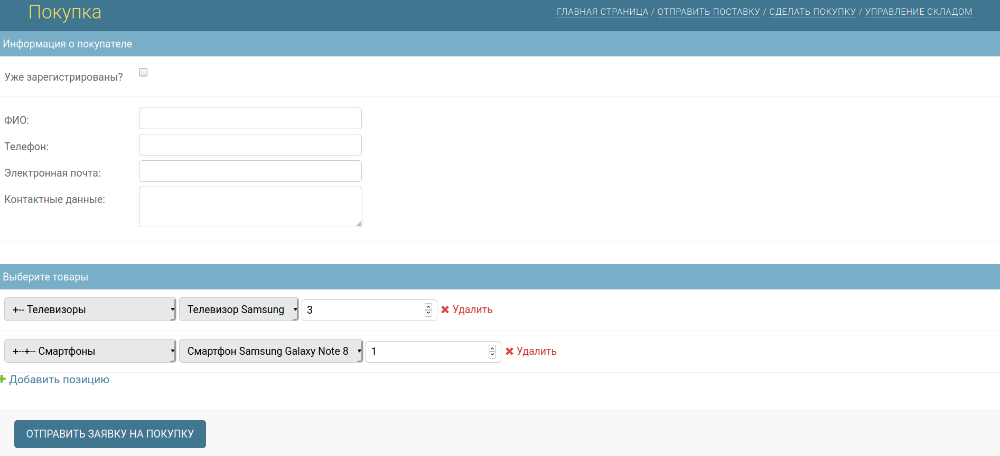
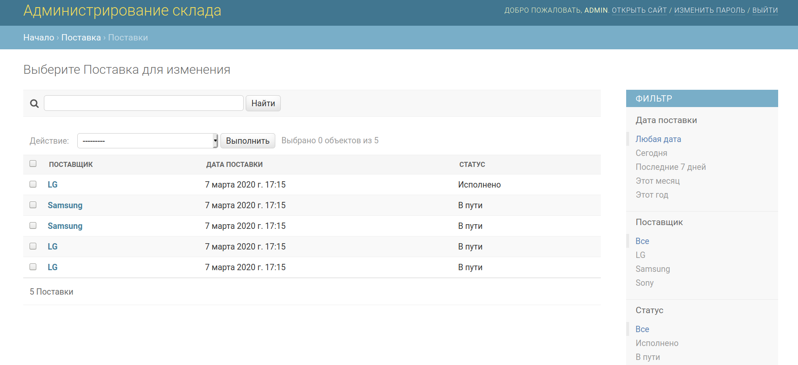
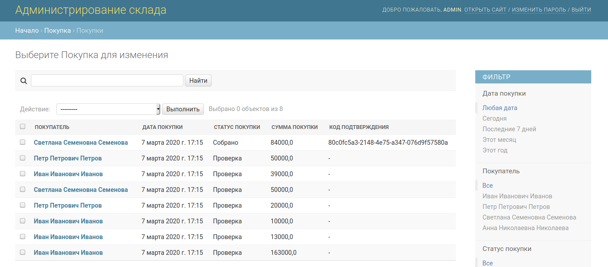
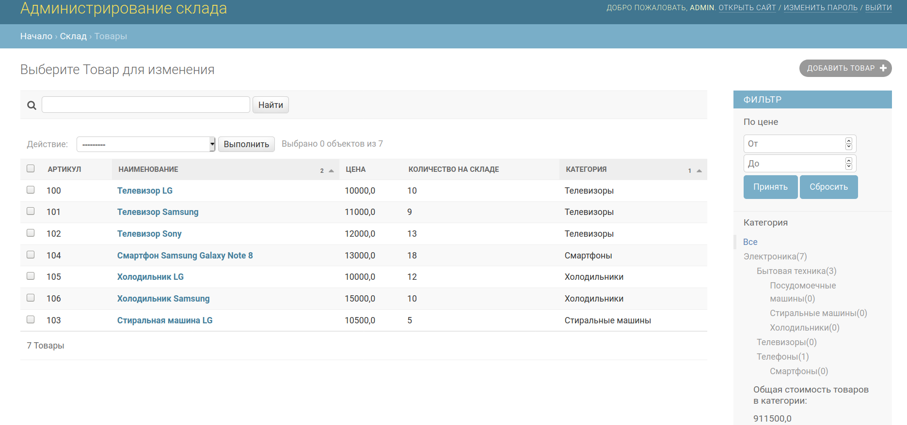
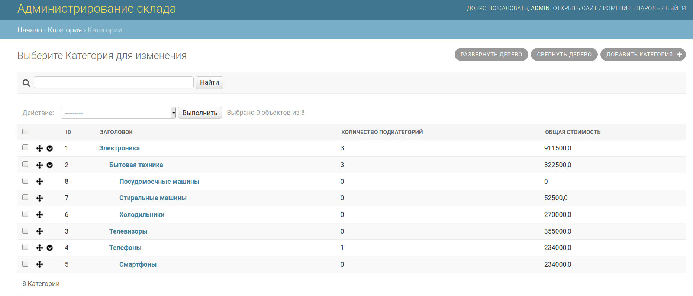

[](https://tldrlegal.com/license/mit-license) <br>

<hr>

Тестовое CRUD-приложение системы складского учёта на Django 3.0.3 с базой данных SQLite3.
Использованы внешние библиотеки mptt, jquery formsets, qrcode.

<details>
  
  <summary> 
    Структура приложения
  </summary>

```
├── manage.py
├── Readme.md
├── Pipfile
├── actionlog
|   ├── __init__.py
|   ├── admin.py
|   ├── apps.py
|   ├── forms.py
|   ├── models.py
|   ├── signals.py
|   └── tests.py
├── cargo
|   ├── migrations
|   |   └── ...
|   ├── __init__.py
|   ├── admin.py
|   ├── apps.py
|   ├── forms.py
|   ├── models.py
|   ├── signals.py
|   ├── tests.py
|   └── templates
|       └── cargo
|           └── cargo_formsets.html
├── category
|   ├── __init__.py
|   ├── admin.py
|   ├── apps.py
|   ├── models.py
|   └── tests.py
├── common
|   ├── migrations
|   |   └── ...
|   ├── static
|   |   └── common
|   |       ├── css
|   |       |   ├── label-text-color.css
|   |       |   ├── link-as-button.css
|   |       |   └── main-page.css
|   |       ├── img
|   |       |   ├── favicon.png
|   |       |   └── workflow.png
|   |       └── js
|   |           ├── jquery-3.4.1.min.js
|   |           ├── jquery.formset.js
|   |           ├── order-formset.js
|   |           ├── stock-formset-cargo.js
|   |           └── stock-formset.js
|   ├── __init__.py
|   ├── admin.py
|   ├── apps.py
|   ├── forms.py
|   ├── models.py
|   ├── signals.py
|   └── tests.py
├── customer
|   ├── migrations
|   |   └── ...
|   ├── __init__.py
|   ├── admin.py
|   ├── apps.py
|   ├── forms.py
|   ├── models.py
|   └── tests.py
├── mainpage
|   ├── templates
|   |   └── mainpage
|   |       ├── base.html
|   |       └── index.html
|   ├── __init__.py
|   ├── apps.py
|   ├── urls.py
|   ├── views.py
|   └── tests.py
├── shipment
|   ├── migrations
|       └── ...
|   ├── __init__.py
|   ├── admin.py
|   ├── apps.py
|   ├── forms.py
|   ├── models.py
|   ├── urls.py
|   ├── tests.py
|   ├── views.py
|   └── templates
|       └── shipment
|           ├── order.html
|           ├── order_successful.html
|           └── shipment_confirmation.html
├── supplier
|   ├── migrations
|       └── ...
|   ├── __init__.py
|   ├── admin.py
|   ├── apps.py
|   ├── forms.py
|   ├── models.py
|   └──  tests.py
├── templates
|   └── admin
|       ├── actionlog
|       |   └── change_form.html
|       ├── cargo
|       |   └── cargo
|       |       └── change_form.html
|       ├── category
|       |   └── change_form.html
|       ├── customer
|       |   └── change_form.html
|       ├── shipment
|       |   └── shipment
|       |       └── change_form.html
|       └── warehouse
|           └── stock
|               ├── stock-price-filter.html
|               └── stock-total-value.html
├── warehouse-management-test
|   ├── __init__.py
|   ├── asgi.py
|   ├── settings.py
|   ├── urls.py
|   └── wsgi.py
└── warehouse
    ├── migrations
    |   └── ...
    ├── __init__.py
    ├── admin.py
    ├── apps.py
    ├── forms.py
    ├── models.py
    ├── filters.py
    └── tests.py
```

</details>

<details>
  
  <summary>
    Что можно сделать
  </summary>

- создать поставку на странице /cargo_new


- создать покупку на странице /order;


- выбрать созданные поставку и покупку на страницах /admin/cargo/cargo/
и /admin/shipment/shipment;



- на странице поставки нажать "Подтвердить получение поставки";
- на странице покупки нажать "Подтвердить готовность к отправке"
(если количество товаров в покупке превышает количество товаров на складе,
кнопка будет скрыта).



</details>

<details>
  
  <summary>
   Как запустить
  </summary>

<br>

- клонировать в нужную директорию
```
$ git clone https://github.com/96tm/warehouse-management-test.git
```
- создать виртуальное окружение
```
$ python3.8 -m venv environment
```
- активировать окружение
```
$ source environment/bin/activate
```
- установить pipenv <br>
```
$ pip3 install pipenv
```
- установить зависимости <br>
```
$ pipenv install
```
- выполнить миграции
```sh
$ python manage.py migrate
```
- создать пользователя с правами администратора

```sh
$ python manage.py createsuperuser
```

- заполнить базу данных тестовыми значениями

```sh
$ python manage.py shell
```

```python
>>> from common.fill_db import fill_db
>>> fill_db()
>>> exit()
```
- изменить email в файле warehouse-management-test/settings.py <br>
(EMAIL_HOST, EMAIL_HOST_USER, EMAIL_HOST_PASSWORD, <br>
DEFAULT_FROM_EMAIL, SERVER_EMAIL, ADMINS)

- запустить сервер

```sh
$ python manage.py runserver
```

</details>
